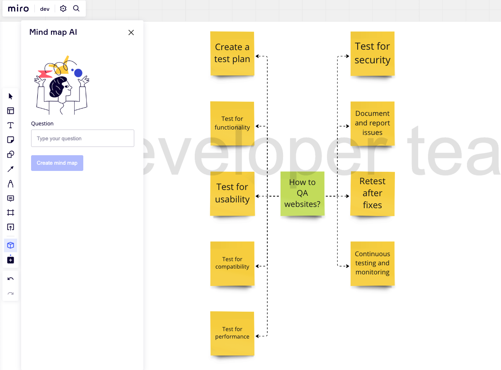

## Miro Mind Map AI

Just a simple Miro plugin to create a Mind map in Miro using ChatGPT

Implemented on a Sunday afternoon. Only one layer of mind map nodes created. Lost more of work to be done to have this ready :)

Current features:
- Insert a question/prompt and click button.
- Uses openAI API to create chat completion.
- Inserts a new frame and adds the sticky notes

Missing features:
- Expand on a sticky note and ask more data
- Avoid drawing frame and sticky notes on existing board items
- many more.. when I have extra Sundays free, however, this was for fun. Check out Miro AI beta which actually implement something like this but cooler.

To run on your side locally

- npm install
- Add .env file using the same keys in sample.env
- Install the miro app on your dev board in Miro

## Create a Miro app

### How to start locally

1. [Sign in](https://miro.com/login/) to Miro, and then create a
   [Developer team](https://developers.miro.com/docs/create-a-developer-team)
   under your user account.

2. [Create an app in Miro](https://developers.miro.com/docs/build-your-first-hello-world-app#step-2-create-your-app-in-miro).

- Click the **Create new app** button.
- On the **Create new app** modal, give your app a name, assign it to your
  Developer team, and then click **Create**.

3. Configure the app:

- In your account profile, go to **Your apps**, and then select the app you just
  created to access its configuration page.
- On the app configuration page, go to **App Credentials**, and copy the app
  **Client ID** and **Client secret** values: you'll need to enter these values
  in step 4 below.
- Go to **App URL** and enter the following URL: `http://localhost:3000`
- Go to **Redirect URI for OAuth2.0**, and enter the following redirect URL:
  `http://localhost:3000/api/redirect/`
- Click **Options**. \
  From the drop-down menu select **Use this URI for SDK authorization**.
- Lastly, go to **Permissions**, and select the following permissions:
  - `board:read`
  - `board:write`

4. Open the [`.env`](.env) file, and enter the app client ID and client secret
   values that you saved at the beginning of step 3 above.
5. Run `npm start` to start developing.

When your server is up and running:

- Go to [Miro.com](https://miro.com).
- In your developer team, open a board.
- To start your app, click the app icon in the app toolbar on the left.
